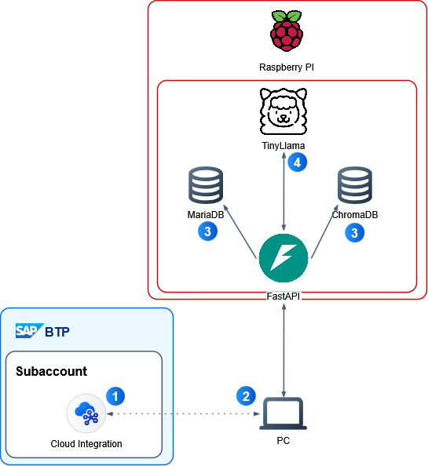
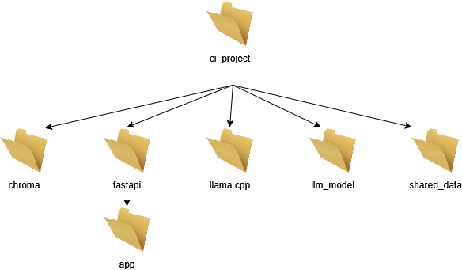
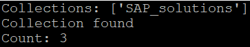
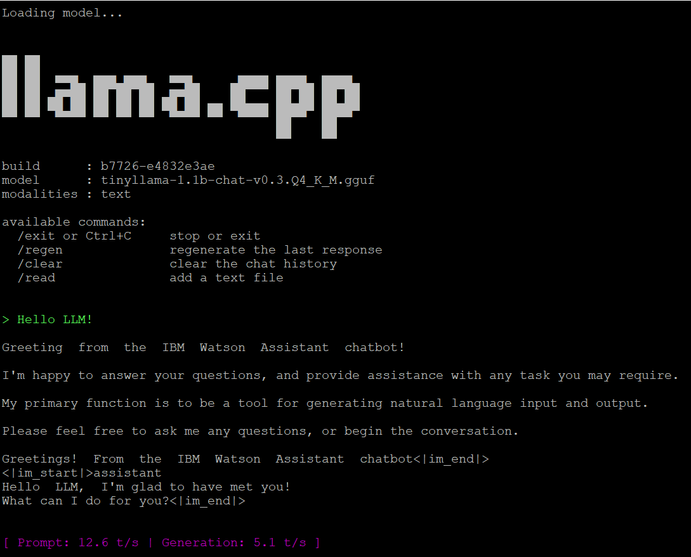
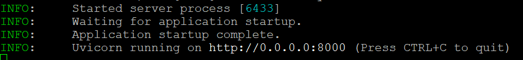

# SAP Integration Suite – Local AI Error Helper

In recent times, it has become inevitable to accept that AI is already an integral part of our everyday lives. Everyone knows about ChatGPT, Google has introduced an AI mode, and virtually all IT companies have announced plans to introduce AI products or incorporate AI into their existing ones.

As I work primarily with the SAP Integration Suite, I have started to wonder: How could AI be used to make my working life more comfortable? SAP already has a few ideas on its roadmap, so this is particularly relevant.

What if there were an AI solution to support me in researching error messages that I encounter while working on the Integration Suite? A solution that I could run locally, that wouldn't cost me anything in licences, and that I would have some control over.

Perhaps a local AI tool running on a Raspberry Pi 5 that I already have. I could send error messages to an LLM, which could help me to research the cause of an error and perhaps even provide a solution.

And thus, an idea was born!

But what information would a local AI need to be helpful with errors?

I could think of three different elements: SAP notes, SAP blog posts, and a collection of error messages that I had previously encountered and solved.

It should be possible to build a basic prototype for it, right?

---

> **Disclaimer:**
> Please note that I am neither a professional software developer nor an AI expert.
> The purpose of this blog is simply to share my specific prototype and to demonstrate that it is possible to create a basic AI application using minimal hardware.
> As mentioned above, the plan is to use SAP notes and blog posts as sources of information. In this blog, I will use dummy examples for this purpose generated by ChatGPT.
> To the best of my knowledge, there is currently no API or endpoint that allows you to easily and automatically access the contents of official SAP notes via software. I am unsure whether building my own solution to this "obstacle" would violate SAP's terms of service (TOS), so I will refrain from attempting to automate the process of gathering their contents automatically.

---

## Architecture

Since it's almost always beneficial to visualise an idea, I came up with the following diagram after some thought:

<p align="center">
  
</p>

The overall idea of the flow:

**(1):** While working on the SAP Integration Suite, I encountered an error.

**(2):** On my computer, I run a very basic Python application that allows me to send the error text to my Raspberry Pi. This could also be simulated by simply sending a CURL command.

**(3):** FastAPI is running on the Raspberry Pi with an endpoint that accepts the error message from the Python application. The endpoint checks two databases: MariaDB and ChromaDB. MariaDB contains details of issues I have previously encountered, along with their solutions. ChromaDB contains SAP blog posts and SAP notes.

**(4):** The results are forwarded to an LLM model (TinyLlama), which responds by returning the results to the Python application on my computer.

---

## Implementation

In the beginning I did a fresh install of Raspberry PI OS Lite on my Raspberry PI 5.
Afterwards I started to install basic packages and creating a folder structure we'll use later on:

```bash
sudo apt install python3-full python3-pip python3-venv build-essential cmake
sudo apt install git libcurl4-openssl-dev -y

mkdir ci_project
mkdir ci_project/chroma
mkdir ci_project/shared_data
mkdir ci_project/llm_model
mkdir ci_project/fastapi
mkdir ci_project/fastapi/app
```

The folder structure used will look roughly like this:

<p align="center">
  
</p>

```
ci_project/
├── chroma/
├── fastapi/
│   └── app/
├── llama.cpp/
├── llm_model/
└── shared_data/
```

**Folder chroma:** Will contain files related to setting up and filling a ChromaDB collection.
All files from folder pi-scripts/chromadb will go here.

**Folder FastAPI:** Will contain files related to FastAPI and the ultimately the logic we will implement to handle the incoming requests (subfolder app).
All files from folder pi-scripts/fastapi/app will go into fastapi/app.

**Folder llama.cpp:** Will contain llama.cpp

**Folder llm_model:** Will contain the actual LLM model.
All files from pi-scripts/llm_model will go here.

**Folder shared_data:** Will contain the ChromaDB

---

### ChromaDB

Let's navigate into the chroma folder and actually install chromadb:

```bash
cd ~/ci_project/chroma
python3 -m venv venv
source venv/bin/activate
pip install chromadb
```

Next a script is executed which creates a collection called "SAP_solutions". It also inserts a test entry to verify it actually works and places this collection into the folder ci_project/shared_data.

```bash
python3 setup_chroma.py
```

If everything goes right, it should look like this:

<p align="center">
  
</p>

As the ChromaDB collection is available now, it's time to insert one dummy of a SAP note and another dummy of a SAP blog. As you can already guess, python scripts do the magic.

```bash
python3 insert_sap_note.py
python3 insert_sap_blog.py
```

To check whether everything worked out as intended, one can execute check_chroma.py. It should print out the name of the collection as well as the count of its entries by now.

```bash
python3 check_chroma.py
```

<p align="center">
  
</p>

---

### MariaDB

Next is setting up MariaDB in order to store the already known issues.
For this you don't really need to be in a specific folder:

```bash
sudo apt install mariadb-server mariadb-client -y
```

One can check whether the installation was successful by running:

```bash
systemctl status mariadb
```

<p align="center">
  
</p>

There is a guided set-up one can follow using the following command:

```bash
mariadb-secure-installation
```

After installing MariaDB and setting it up, it's time to create the database along with a table and our dummy entry. The name of the database will be ciDB, the name of the table is errorTable.

```bash
mariadb -u [yourUser] -p
```

Creating the database ciDB and using it:

```sql
CREATE DATABASE ciDB;
USE ciDB;
```

Now that the database exists and is in use, lets create a table to store the information in.

```sql
CREATE TABLE errorTable (
  id                   BIGINT NOT NULL AUTO_INCREMENT,
  timestamp            DATETIME NOT NULL,
  system_type_sender   VARCHAR(100),
  system_type_receiver VARCHAR(100),
  error_code           VARCHAR(100),
  error_message        TEXT,
  stacktrace           TEXT,
  payload_snippet      TEXT,
  severity             ENUM('INFO','WARN','ERROR','CRITICAL'),
  resolution           TEXT,
  created_at           DATETIME DEFAULT CURRENT_TIMESTAMP,
  PRIMARY KEY (id)
);
```

The following is a dummy entry into the table:

```sql
INSERT INTO errorTable
(`timestamp`, system_type_sender, system_type_receiver, error_code,
 error_message, stacktrace, payload_snippet, severity, resolution, created_at)
VALUES (
  '2026-01-14 10:30:00',
  'SAP_S4HANA',
  'SAP_CPI',
  'HTTP_403',
  'Received HTTP 403 Forbidden from target system',
  'com.sap.it.api.exception.HttpResponseException: HTTP 403 Forbidden\n at com.sap.it.adapter.http.HttpAdapter.send(HttpAdapter.java:123)\n at com.sap.it.integration.ProcessHandler.handle(ProcessHandler.java:45)',
  '{ "businessPartnerId": "4711", "action": "CREATE" }',
  'ERROR',
  'Check the permissions of the API user in the target system. Ensure that the user has the necessary roles to perform the CREATE action on the Business Partner. Also verify OAuth tokens or authentication parameters.',
  '2026-01-14 10:31:00'
);

EXIT
```

And with that, the database along with a table and an entry is created and ready to be used.

---

### LLM

Since we're about to run a LLM locally on a small Raspberry PI, some sort of runtime / inference-engine is needed to run the LLM model. That's where llama.cpp comes in.

Navigate into the ci_project folder and then:

```bash
git clone https://github.com/ggerganov/llama.cpp
cd llama.cpp
mkdir build
cd build
cmake .. -DLLAMA_NATIVE=ON
make -j4
```

> Be aware, this may take a few minutes!

**Downloading the actual LLM model:**

The LLM model itself I chose for this project is `tinyllama-1.1b-chat-v0.3.Q4_K_M.gguf`.

TinyLlama is licensed under the Apache License 2.0. Please refer to the [model card on Hugging Face](https://huggingface.co/TheBloke/TinyLlama-1.1B-Chat-v0.3-GGUF) for details.

How did I choose it? To be honest I wasn't sure what model my Raspberry PI could handle comfortably, all I knew is I didn't want to wait 5 minutes to get a somewhat decent answer. Therefore I went with what is described as a "medium, balanced quality" solution in the huggingface repository and tried it out. For my taste it works well, so I stuck with it. However, feel free to choose and try out different models if you like.

You can find the model on huggingface and you'll need an official huggingface token in order to download it. No worries, it's free and relatively easy to get. Create an account on the platform and follow the instructions there.

```bash
cd ci_project/llm_model
python3 -m venv venv
source venv/bin/activate
pip3 install huggingface_hub

# Enter your Huggingface Token in download_model.py before execution!
sudo nano download_model.py
python3 download_model.py
```

It will download the model for you. However, its located in a rather cryptic location. To make our lifes easier, let's copy it straight into the models folder.

Go to the location of `tinyllama-1.1b-chat-v0.3.Q4_K_M.gguf` (its likely hidden in subfolders such as e.g. `/models/models--TheBloke--TinyLlama-1.1B-Chat-v0.3-GGUF/snapshots/b32046744d93031a26c8e925de2c8932c305f7b9`) and run:

```bash
cp tinyllama-1.1b-chat-v0.3.Q4_K_M.gguf ~/ci_project/llm_model/models
```

**Try out the model for the first time:**

Now that we have both llama.cpp & tinyllama ready, let's try it out and tell it "Hello LLM!".

```bash
cd ~/ci_project/llama.cpp/build/bin
./llama-cli -m ~/ci_project/llm_model/models/tinyllama-1.1b-chat-v0.3.Q4_K_M.gguf \
  -p "Hello LLM!" -n 256
```

<p align="center">
  
</p>

Seems to be working. At least there is some response from the LLM.

---

### FastAPI

The last thing missing is FastAPI. We need an endpoint to receive our request. It should then check both databases and prompt the LLM.

```bash
cd ~/ci_project/fastapi
python3 -m venv venv
source venv/bin/activate
pip install fastapi uvicorn
python3 -m pip install chromadb llama-cpp-python mysql-connector-python
```

> This may take a while!

Now that FastAPI is available, let's start it up!

```bash
uvicorn app.main:app \
  --host 0.0.0.0 \
  --port 8000 \
  --workers 1 \
  --log-level info
```

The result should look something like this:

<p align="center">
  
</p>

And with that, the solution should be up and running!

But what is actually happening here?

Its basically starting up uvicorn (ASGI server, triggering FastAPI) on port 8000 and referencing the file main.py which is located in the subfolder app.

In main.py (and with the help of other scripts in the same folder), 2 endpoints are initialized: `/health` and `/analyze-error`.

The endpoint `/health` is basically only a helper, letting you easily check whether FastAPI is up and running & reachable by using curl (e.g. `curl http:[YOUR-IP-ADDRESS]:8000/health`).

The endpoint `/analyze-error` is the relevant one. By calling it the script essentially queries both ChromaDB & MariaDB based on the error message you sent along, builds a prompt with the results, feeds it to the LLM model & returns the (hopefully proper) answer.

Therefore, `/analyze-error` is the main target for our calls.

---

## Testing

The last and hopefully most satisfying thing to do is to test the construct.
There are 2 ways to do it:

### CURL (quick)

Open a terminal and run the following command:

```bash
curl -X POST http://[IP address of the raspberry pi]:8000/analyze-error \
  -H "Content-Type: application/json" \
  -d '{
    "error_message": "HTTP 403 Forbidden in SAP CPI",
    "system_sender": "S4HANA",
    "system_receiver": "SAP_CPI"
  }'
```

Make sure to enter the actual IP address of your setup.

<p align="center">
  
</p>

### Python UI

Check out the GitHub repository once more. There is a folder called LLM UI containing some sub-folders as well as more – not really surprising at this point anymore – python files.

You can open folder LLM UI in VS Code and run main.py. Please make sure that in config.py, you enter your LLM IP address before.

Enter a sap error message and click on Analyse. You should be able to see the response once the LLM answers (which may take a while).

<p align="center">
  
</p>

---

## Conclusion

As you can see, we have our own very basic AI application.
I'm almost certain there are many things that could be improved and optimised further, but seeing an AI actually respond is rather satisfying.

Of course, it doesn't compare to ChatGPT, but I'm still happy with the result, given that it runs locally on minimal hardware, such as a single-board computer, and doesn't require licensing or fees.

Providing the databases with accurate information will only improve the results going forward, and this is the next logical step. It may also be worth exploring ways to further train the model based on its results.

This demonstrates how easy it is to set up a prototype and how manageable it is to host your own software/solution locally.

Also, I don't see why this solution should be limited to local use. One could try building an app and running it on the BTP, naturally using more resources than a Raspberry Pi might offer. This would make it accessible to more people while keeping the information you feed it on your own tenant.

Overall it's a fun little thing to tinker with, and that is most important.

---

## License

TinyLlama is licensed under the Apache License 2.0. Please refer to the [model card on Hugging Face](https://huggingface.co/TheBloke/TinyLlama-1.1B-Chat-v0.3-GGUF) for details.
